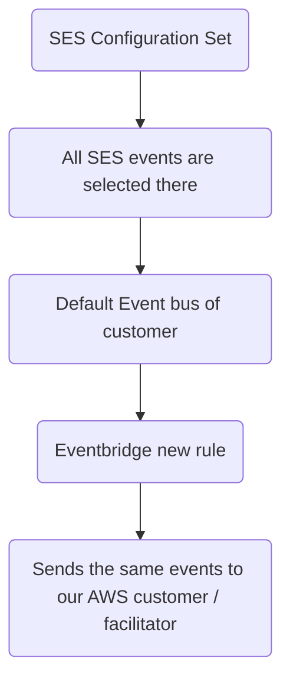

# SES Email Tracker - SESami
SESami stands for SES-friend (_ami_ is a French word that means friend).\
With SES, you can programmatically send your emails, and also get a Virtual Deliverability Dashboard.

But you never get to know exactly:
- which emails bounced
- which ones got opened and clicked (and when)
- which link in email got clicked, and how many times
- which email recipients out of the bulk opened your email
- which recipient complained / reported your email as spam


SES helps you:
- send emails (did we mention, for dirt cheap?)
- list templates that you have created
- check your sending statistics (not detailed)

SES is great for sending emails in bulk via API calls, maintaining a great reputation while you're at it.

## The catch?

SES doesn't have any interface where you can:
- send an email
- keep a custom suppression list
- track individual email events (e.g. which link was clicked?)


These are features we all were quite missing (and what every SES user secretly wanted), and so we decided to use AWS services to make it happen, all event-driven.


## Our motivation for building this

For everyone who uses SES, SESami would make filtering emails by date-time, and drilling down via statuses; a tad bit easier.\
We had two options:


This is a multi-tenant app, which means you can have multiple users and AWS accounts.

Here's an example where our app filters out the `DELIVERED` events by date and time, all sorted in descending order:


It only needs 3 things from the user:
- AWS account ID
- IAM Role ARN
- STS External ID (we'll supply this from our end)


## Tech Stack
### Frontend
- [SolidJS](https://www.solidjs.com/)
- [SolidStart](https://start.solidjs.com/) (meta framework)
- [AWS Amplify](https://aws.amazon.com/amplify/)
- [TypeScript](https://www.typescriptlang.org/)
- [ChartJS](https://www.chartjs.org/)
### Backend
- [Momento Cache](https://www.gomomento.com/platform/cache/)
- [Amazon EventBridge](https://aws.amazon.com/eventbridge/)
- [AWS IAM](https://aws.amazon.com/iam/)
- [Amazon SES](https://aws.amazon.com/ses/)
- [AWS STS](https://docs.aws.amazon.com/iam/#sts) (Security Token Service)
- [Amazon DynamoDB](https://aws.amazon.com/dynamodb/)
- [AWS Lambda](https://aws.amazon.com/lambda/)
- [AWS LLRT](https://github.com/awslabs/llrt)
- [AWS CDK](https://aws.amazon.com/cdk/)
- [Amazon API Gateway](https://aws.amazon.com/api-gateway/)
- [Amazon CloudWatch](https://aws.amazon.com/cloudwatch/)
- [Amazon Cognito](https://aws.amazon.com/cognito/)

## Our initial implementation
Starting out, this is all we had in [Excalidraw](https://excalidraw.com/), when it came to designing UI &darr;


We had to implement:
| Feature       | Situation     |
| ------------- | ------------- |
| a custom suppression list |  |
| event tracking |  |

We needed to know exactly who, when and why our emails were opened.

- **Who?** thatguy@email.com
- **When?** 18/5/2025, 11:55:23 pm
- **Why?** Impossible to know, unless AI starts reading minds.

## Use of Momento Cache
We assume the role, and then we get the token of AWS credentials from STS for the source account (which we are using to send emails).
So we store the token on Momento, so that we don't generate it on every API request.


STS tokens have an expiration time of 1 hour by default.
When the user uses our SendEmail API to send emails, we fetch the token from Momento cache, and use it to authenticate and send emails on behalf of them.

## Use of Amazon EventBridge
The source account uses AWS configuration set to enable SES events to be sent on the default event bus. Then the source account creates a new EventBridge rule to send that event to send that event to our AWS account or the destination account, and to our event bus.


Our AWS account event bus has a resource policy which allows external AWS account to send events to us directly. Then we have a Lambda function which listens to the event on event bus, categorises, and stores the event in Amazon DynamoDB.

## Why are we using API Gateway?


We are using API Gateway to route requests to AWS Lambda. We have the following endpoints:

| Path                | Method | Description                                                 |
| ------------------- | ------ | ----------------------------------------------------------- |
| `/events`           | GET    | Gets all the events while filtering date and status         |
| `/suppression-list` | GET    | Gets all the email addresses in the custom suppression list |
| `/verify-sts`       | GET    | Verifies the assumed role                                   |
| `/mail`             | POST   | Sends emails                                                |
## Use of Amazon Cognito
To authenticate users, we use custom attributes to assign their custom ID, sts role and external ID.


When user tries to send email via us, we fetch the attributes from the user and then we generate the token based on account.\
Then we store it in the Momento Cache.
## Usage of AWS CDK (Cloud Development Kit)
CDK allows us to easily configure AWS Lambda and all the other services.


All the AWS services have been configured via CDK, as it provides a configured way to manage all the AWS services.
## Why are we using AWS Amplify?
We are logging and signing up our users via Amazon Cognito.


AWS Amplify SDK helps us with the hosting and static web app deployment of our SolidJS app.

## Using AWS LLRT, and not NodeJS
Since LLRT is written in Rust and has ~ 10 MB of bundled size, it reduces the cold start of Lambda; hence reducing the response time of our API.
Our API now responds in < 200 ms.

## RBAC (Role Based Access Control)

In order to use SESami (SES Email Tracker), first you need to have your SES enabled in production mode (out of the sandbox), then create a permission policy and an IAM role to allow access by connecting your AWS SES.

- Role Based Access Control
- Source / customer account: Creates IAM role with Trust Policy to allow our AWS account to access SES (Least Privilege Principle)


- To use SES API, the source account calls our SES API proxy
	- We get the token validated
	- The resource based policy in our AWS account allows the specified account to send events to our bus directly, as it is attached to our AWS Event bus
- EventBridge rule
	- Role ARN
	- External ID
- sts:AssumeRole (1 hour by default)

Here's a flow diagram to better explain what's happening under the hood:


We send emails on behalf of them (the customer or source account) and do suppression checks, and we'll also be logging the email content in future.

We can't keep sending emails to users who keep reporting us as spam.\
Otherwise, this happens &darr;


### Creating an Amazon EventBridge rule
#### Define rule detail
- First we go to Amazon EventBridge &rarr; Rules &rarr; Create rule
- We give it a name, and select `default` from the **Event bus** dropdown
- We enable the toggle for the rule on selected event bus
- We select **Rule with an event pattern** in **Rule detail** and click Next


#### Build event pattern
- In **Creation method**, we select **Use pattern form**
- In **Event source**, we select **AWS Services**
- In **AWS Service**, we select **Simple Email Service (SES)**
- In **Event type**, we select **All Events**, and click Next


#### Select target(s)
- We select **EventBridge event bus** as target
- In **Target types**, we select **Event bus in a different account or Region**
- We put the recently created ses-event-bus's ARN in **Event bus as target**
- In **Execution role**, we chose to **Create a new role for this specific resource**
- We leave the role name as-is, and click Next


We update our external ID in IAM &arr; Role &rarr; SES-RBAC &rarr; Trust Relationships

```json
{
    "Version": "2012-10-17",
    "Statement": [
        {
            "Sid": "Statement1",
            "Effect": "Allow",
            "Principal": {
                "AWS": "arn:aws:iam::205979422636:role/AWSMailSES"
            },
            "Action": "sts:AssumeRole",
            "Condition": {
                "StringEquals": {
                    "sts:ExternalId": "TgkeVMykC5ePaij8oV0gV"
                }
            }
        }
    ]
}
```
####


We add an identity:


Now we are all set to allowing our AWS account to send emails on behalf of the customer's SES account!

## Future Scope

- Subscription Management
	- Verified Users List
	- Unsubscribed Users List
- Email Content Storage
	- Templates
- Bulk Emailing API
- Caching suppressed users on Momento Cache (instead of DynamoDB)
- Date and Time Presets for filtering events (1 year, 1 month, 1 week etc.)
- Filtering by email address of users
- Allow suppression list to be modified (adding, editing, deleting user email addresses)
- Sync suppression list with AWS (to ensure non-deliverability of emails for suppressed users)
