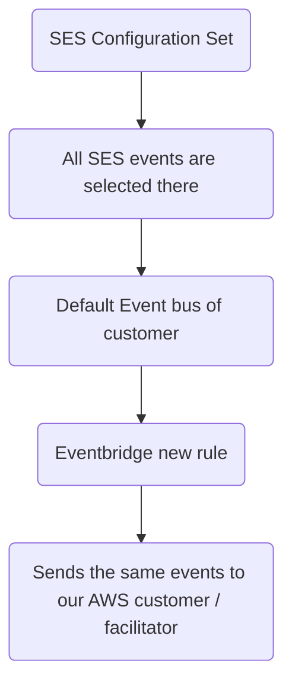

With SES, you can programmatically send your emails, and also get a Virtual Deliverability Dashboard.

But you never get to know exactly:
- which emails bounced
- which ones got opened and clicked (and when)
- which email recipients out of the bulk opened your email
- which recipient complained / reported your email as spam

SES is great for sending emails in bulk via API calls, maintaining a great reputation while you're at it.

But the ones we just mentioned?
These are features we all were quite missing, and so we decided to use AWS features to make it happen.

![[ses-account-dashboard-metrics.png]]

## Tech Stack
### Frontend
- SolidJS
- SolidStart (meta framework)
- AWS Amplify
- TypeScript
- ChartJS
### Backend
- Momento Cache
- Amazon EventBridge
- AWS IAM
- Amazon SES
- AWS STS
- Amazon DynamoDB
- AWS Lambda
- AWS LLRT
- AWS CDK
- Amazon API Gateway
- Amazon CloudWatch
- Amazon Cognito

## Why are we using Momento Cache?
We assume the role, and then we get the token of AWS credentials from STS for the source account, which we are using to send emails.
So we store the token on Momento, so that we don't generate it on every API request.

STS tokens have an expiration time of 1 hour by default.
When user uses our SendEmail API to send emails, we fetch the token from Momento cache and use it to send emails on behalf of them.

## Why are we using Amazon EventBridge?
The source account uses AWS configuration set to enable SES events to be sent on the default event bus. Then the source account creates a new EventBridge rule to send that event to send that event to our AWS account or the destination account, and to our event bus.

Our AWS account event bus has a resource policy which allows external AWS account to send events to us directly. Then we have a Lambda function which listens to the event on event bus, categorises, and stores the event in Amazon DynamoDB.

## Why are we using API Gateway?
We are using API Gateway to route requests to AWS Lambda. We have the following endpoints:

| Path                | Method | Description                                                 |
| ------------------- | ------ | ----------------------------------------------------------- |
| `/events`           | GET    | Gets all the events while filtering date and status         |
| `/suppression-list` | GET    | Gets all the email addresses in the custom suppression list |
| `/verify-sts`       | GET    | Verifies the assumed role                                   |
| `/mail`             | POST   | Sends emails                                                |
## Where are we using Amazon Cognito?
To authenticate users, we use custom attributes to assign their custom ID, sts role and external ID.
When user tries to send email via us, we fetch the attributes from the user and then we generate the token based on account. Then we store it in the Momento Cache.
## How are we using AWS CDK (Cloud Development Kit)?
CDK allows us to easily configure AWS Lambda and all the other services.
All the AWS services have been configured via CDK, as it provides a configured way to manage all the AWS services.
## Why are we using AWS Amplify?
We are logging and signing up our users via Amazon Cognito.
AWS Amplify SDK helps us with the hosting and static web app deployment of our SolidJS app.

## Why are we using AWS LLRT, and not NodeJS?
Since LLRT is written in Rust and has ~ 10 MB of bundled size, it reduces the cold start of Lambda; hence reducing the response time of our API.
Our API now responds in < 200 ms.

## RBAC

In order to use SESami, first you need to have your SES enabled in production mode (out of the sandbox), then create a permission policy and an IAM role to allow access by connecting your AWS SES.

- Role Based Access Control
- Source / customer account: Creates IAM role with Trust Policy to allow our AWS account to access SES (Least Privilege Principle)
- To use SES API, the source account call our SES API proxy
	- We get the token validated
	- The resource based policy in our AWS account allows the specified account to send events to our bus directly, as it is attached to our AWS Event bus
- EventBridge rule
	- Role ARN
	- External ID
- sts:AssumeRole (1 hour by default)

We send emails on behalf of them (the customer or source account) and do suppression checks, and we'll also be logging the email content in future.

## Creating an Amazon EventBridge rule

![[Screenshot 2025-05-15 at 2.16.54 PM.png]]

![[Screenshot 2025-05-15 at 2.17.50 PM.png]]

![[Screenshot 2025-05-15 at 2.19.05 PM.png]]

We updated our external ID in IAM Role SES-RBAC -> Trust Relationships

![[Pasted image 20250517123803.png]]

We add an identity:

![[Pasted image 20250518213401.png]]

## Future Scope

- Subscription Management
	- Verified Users List
	- Unsubscribed Users List
- Email Content Storage
	- Templates
- Bulk Emailing API
- Caching suppressed users on Momento Cache (instead of DynamoDB)
- Date and Time Presets for filtering events (1 year, 1 month, 1 week etc.)
- Filtering by email address of users
- Allow suppression list to be modified (adding, editing, deleting user email addresses)
- Sync suppression list with AWS (to ensure non-deliverability of emails for suppressed users)
- 
